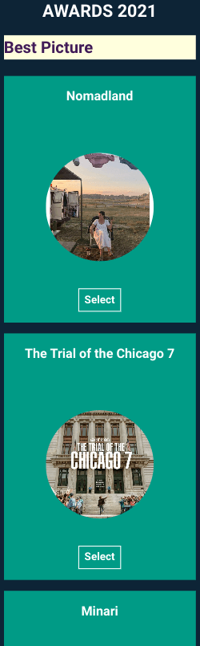
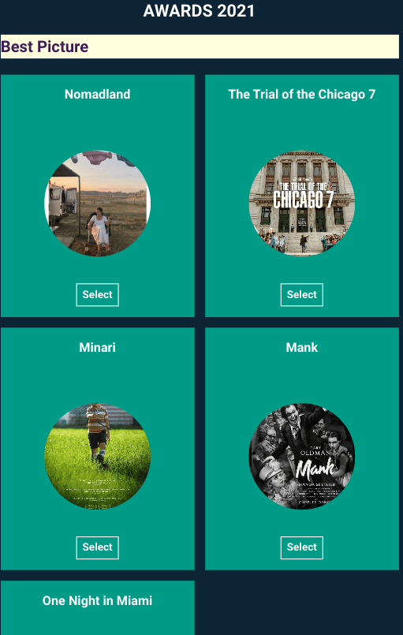
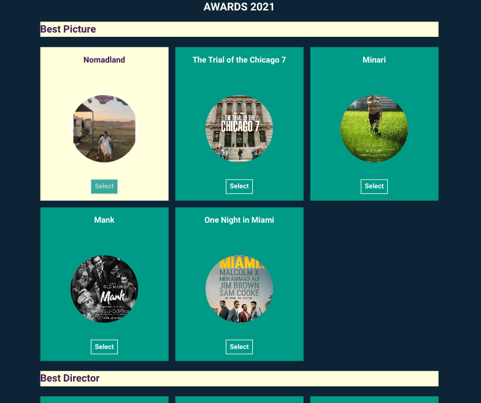
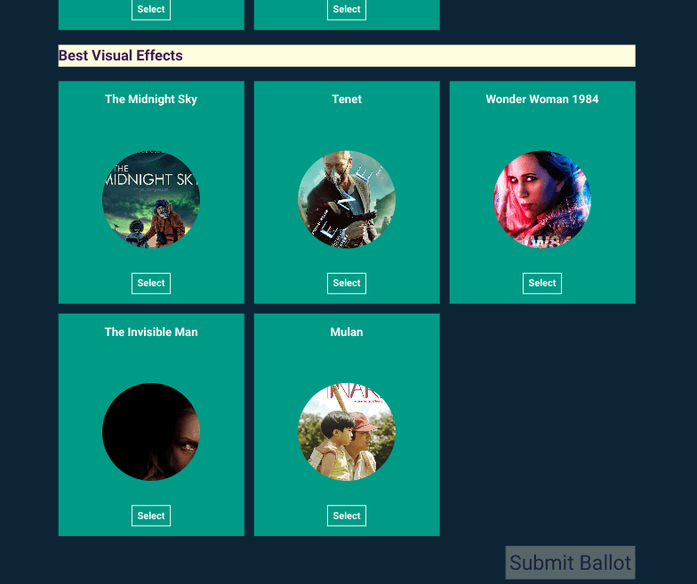
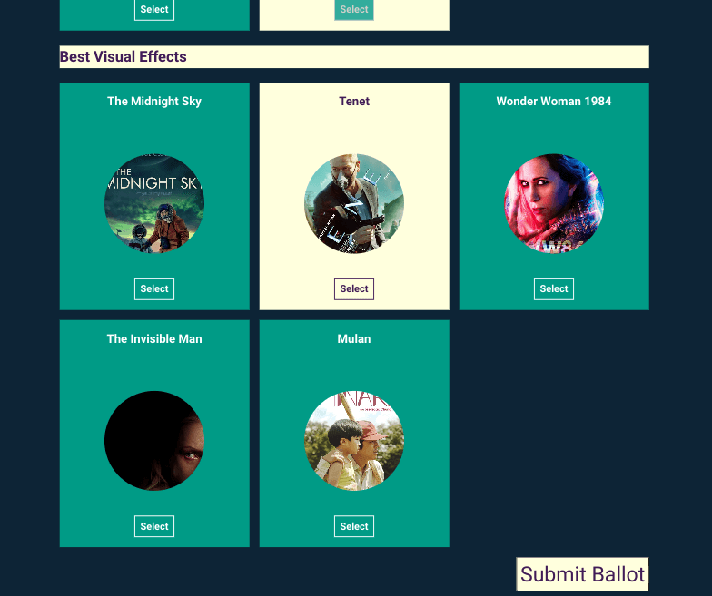
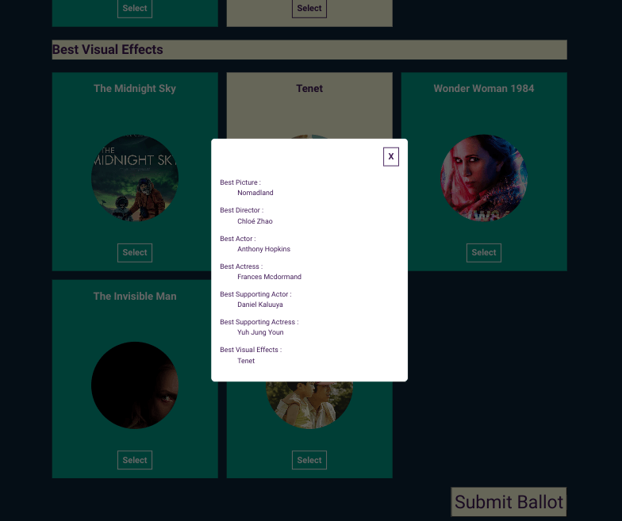

# DailyPay Front End Engineering Challenge

This is a solution to this [repo](https://github.com/dailypay/react-take-home-test).

## Screenshots



***



***



***



***



***



***

## The Task

Welcome Candidate and thank you for taking the time to complete the DailyPay take-home challenge for our senior frontend engineer position

You will have 2 days to complete the assignment. Once you have completed your solution, please reply with a link to a github repository and instructions on how to install / run the application

The goal of this challenge is to build out a "Movie Awards 2021" interactive ballot. Please clone this repository and submit it once you are finished.

Here are the rules of this challenge.. you must:

 1) Build an application that displays a list of categories and nominees. Please follow the design in the wireframe below. Run `npm run dev` to start the application.
 2) Run `npm backend` to start the server and get access to API methods such as `getBallotData`. Use the React `useEffect` hook to fetch the ballot data from the provided API, and save it to state by using the React `useState` hook.
 [useEffect Documentation](https://reactjs.org/docs/hooks-effect.html)
 [Fetch API Documentation](https://developer.mozilla.org/en-US/docs/Web/API/Fetch_API/Using_Fetch)
[useState Documentation](https://reactjs.org/docs/hooks-state.html)
 3) When you click on a nominee, we should highlight the nominee card and save the selections using the React `useState` hook. A user can only select one nominee per category, and we should be able to see all of their selections highlighted. The selected nominee card should follow the style guides below.
 4) Make the layout responsive with at least one breakpoint (your choice as to how it looks on a smaller screen width).
 5) Once the user is finished making their selections, they can click on a submit button that displays a results modal screen. A user can dismiss the modal by clicking on the close button (follow the wireframe below).

### Requirements:
 1) All navigation should happen in the same page
 2) Demonstrate use of React hooks
 3) Demonstrate knowledge of component modularization
 4) Utilize CSS to create the layout of the page. Add hover styles to the items the user is interacting with.
 5) Create components as you feel is best suited for your solution


### Bonuses
2) Make it pretty
3) Make it accessible
4) Add unit tests

### Styling Guidelines

- Use the "Roboto" Google font   
- Use the following colors   
	- Page background: -  `#0D2436`
	- Default/normal font color:  `#FFFFFF`
  - Hover font color:  `#CCCCCC`
	- Nominee card / submit button background:  `#009B86`
  - Selected Nominee card:  `#009B86`
  - Nominee card background hover / submit button background hover:  `#34AC9C`

## My Process

## Built with

- Vite
- Vitest
- React
- Typescript
- Express

## How to Use

The Express application runs by default on `localhost:8080` and has the following endpoints:

 - `http://localhost:8080/api/getBallotData` - returns a object with items key that has list of award nominees.

### Running the Express Application

```sh
cd dailypay-frontend-challenge
npm install
npm run backend
```

You can verify the API is working by visiting http://localhost:8080/api/getBallotData in
your browser or another HTTP client.

### Running the React Application

Needs the express application running.  Use two terminals.  

```sh
cd dailypay-frontend-challenge
npm run dev
```

## Thoughts

- errors in the data - olivia coleman and chloe with/without accent
- Could use radio buttons in a radio group and hide the radio button appearance and add a button in the radio input's place
- Design makes semantic html more difficult - better to add accessible features on top of custom solution ?
- Once you select a nominee can't set state for that category back to undefined
- Included API only serves the purpose of making sure candidate understands fetch requests
- Didn't handle loading and error states on the api request
- Used `clip-path: circle()` to make the images circles - hard to get best view in every movie poster - commented out an adjustment I used at one point
- Close button used an 'X' - could get a svg for close button

## Useful Resources

- [Stack Overflow](https://stackoverflow.com/questions/39818569/pass-id-through-on-click-react-js) - pass id through on click
- [YouTube](https://www.youtube.com/watch?v=vL2io1XCGzc) - Custom select option based on div (Card Selection) in reactJS
- [YouTube](https://www.youtube.com/watch?v=n2vd1LC6nvg) - Styling Radio Buttons As Cards | Pure CSS
- [YouTube](https://www.youtube.com/watch?v=SXJ_dxzPaYE) - HTML & CSS Custom Radio Buttons With Cool Effect | Pure CSS | CSS Radio Buttons
- [YouTube](https://www.youtube.com/watch?v=D5oswSO9y-k) - Build A Custom React JS Modal - Using Hooks (Pop-up Window)
- [Stack Overflow](https://stackoverflow.com/questions/26421274/css-circular-cropping-of-rectangle-image) - css circular cropping of rectangular image
- [Stack Overflow](https://stackoverflow.com/questions/196972/convert-string-to-title-case-with-javascript) - convert string to title case case with javascript
- [Stack Overflow](https://stackoverflow.com/questions/61654862/how-to-get-the-value-of-the-span-element-with-testid-using-react-testing-library) - testid values
- [YouTube](https://www.youtube.com/watch?v=yTZ-txdrHdY) - How to Test React Components That Use Fetch